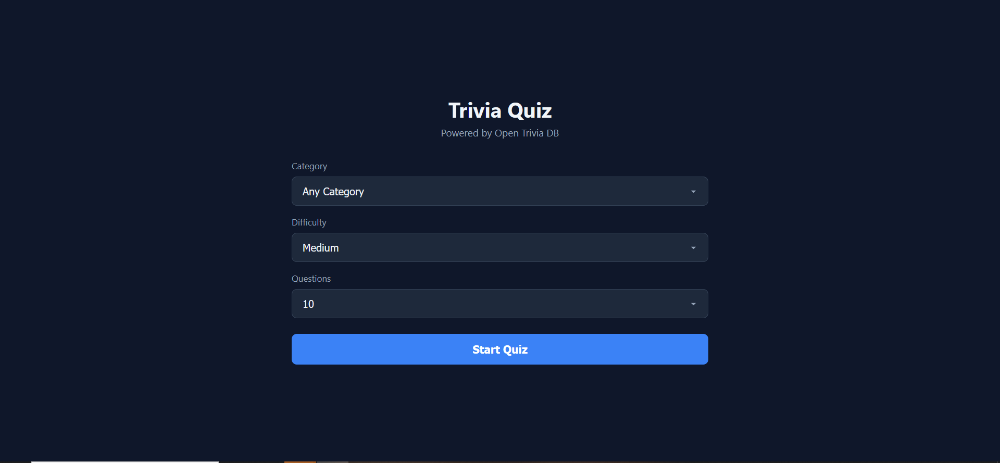
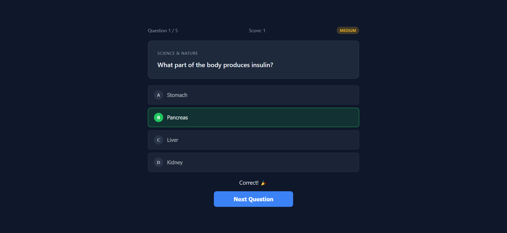
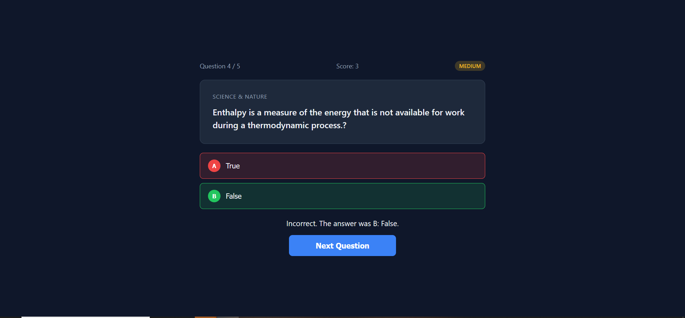
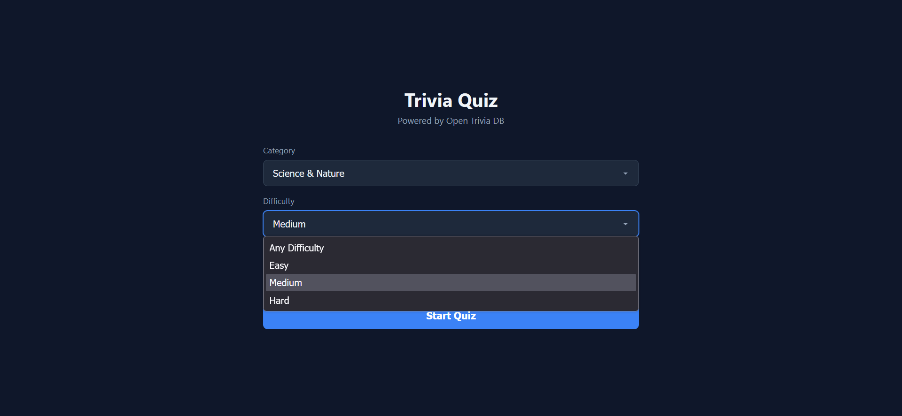

# Quiz Generator

A trivia quiz app that gets smarter as you play.

Pick a category, answer questions, and watch the difficulty adjust to match your skill level. Get three in a row right and the questions get harder. Struggle with two wrong and it eases up. The app figures out your level and keeps you in the sweet spot — challenged but not frustrated.

No account needed. No sign-up. Just open it and play.

---

## How It Works

The app is built around three components that work together:

### MCP Server (`mcp/server.js`)

An MCP (Model Context Protocol) server that wraps the [Open Trivia DB](https://opentdb.com/) API. It handles fetching questions, decoding HTML-encoded text, and returning clean data. The frontend and Claude Code both use this server as the single source for trivia data — no direct API calls anywhere else.

### Quiz Design Skill (`.claude/skills/quiz-design/SKILL.md`)

A processing layer that sits between fetching and display. Every question passes through these checks before you see it:

- **HTML entity decoding** — turns `&amp;`, `&#039;`, etc. into readable text
- **Answer shuffling** — the correct answer goes into a random position so it's not always option D
- **Quality gate** — rejects questions with "all of the above" phrasing, duplicate answers, leaked HTML, or answers given away in the question text
- **Difficulty consistency** — makes sure questions don't jump randomly from easy to hard

### Difficulty Calibrator (`.claude/agents/difficulty-calibrator.md`)

A subagent that watches your recent answers and recommends the next difficulty level:

| Your recent performance | What happens |
|---|---|
| 3 correct in a row | Difficulty goes up |
| 2 wrong in a row | Difficulty goes down |
| Mixed results | Difficulty stays the same |
| Already at the hardest level | Holds steady (can't go higher) |
| Already at the easiest level | Holds steady (can't go lower) |

The calibrator runs between questions — you answer, it analyzes, and the next question is fetched at the recommended difficulty.

---

## Screenshots

### Main Quiz Screen



### Answered Question — Correct Feedback



### Answered Question — Incorrect Feedback



### Difficulty Change in Action



---

## Getting Started

### Prerequisites

- [Node.js](https://nodejs.org/) (v18 or later)
- npm (comes with Node.js)

### Install

```bash
git clone https://github.com/TheDevPP/quiz-generator.git
cd quiz-generator
npm install
```

### Run the App

```bash
npm start
```

Then open **http://localhost:3000** in your browser.

### Run the MCP Server (for Claude Code)

The MCP server runs over stdio and is used by Claude Code workflows:

```bash
npm run mcp
```

The `.mcp.json` file at the project root configures Claude Code to use this server automatically.

---

## Built With

- **HTML / CSS / JavaScript** — plain frontend, no framework
- **Express** — serves the frontend and the `/api/questions` endpoint
- **Open Trivia DB** — free trivia question database ([opentdb.com](https://opentdb.com/))
- **MCP SDK** (`@modelcontextprotocol/sdk`) — Model Context Protocol server for Claude Code integration
- **Zod** — input validation for the MCP server
