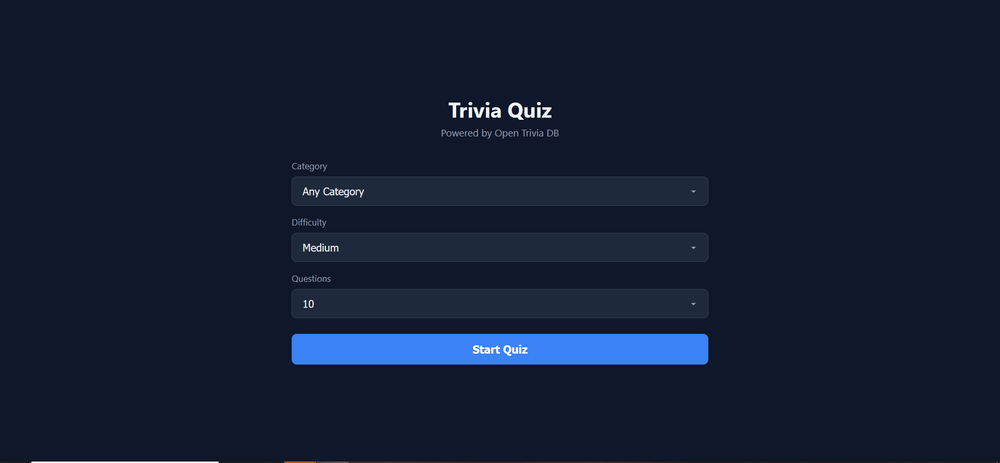
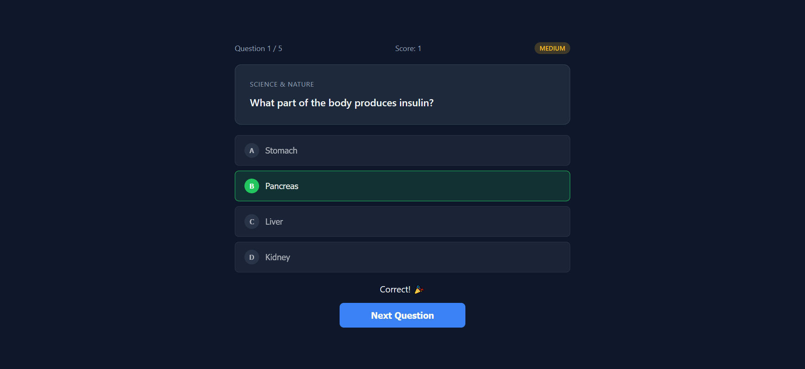

# Quiz Generator
> Name: TBD — to be updated before launch

A health education quiz platform for teenagers and youth in Myanmar, focused on adolescent health, general health, and sexual and reproductive health (SRH).

Questions are generated from verified medical reference handbooks using Claude API, reviewed and approved by a volunteer doctor before going live. Three question types keep learning engaging: multiple choice, true/false myth-busting, and real-life scenario questions.

**We don't collect any information about you. Ever.**

No account. No sign-up. No tracking. Just open it and learn.

---

## Who It's For

Teenagers and youth in Myanmar who need accurate, non-judgmental health information in a format that's actually engaging. Topics cover adolescent health, general health, and sexual and reproductive health (SRH) — areas where misinformation is common and trusted, accessible resources are rare.

---

## How It Works

The platform is built around three components that work together:

### MCP Server (`mcp/server.js`)

A custom MCP (Model Context Protocol) server that connects to Cloudflare R2 private storage. It handles all document interactions — no direct R2 access happens anywhere else in the codebase.

**Tools exposed:**
- `extract_reference(file_path)` — downloads a PDF or Word document from R2, extracts and chunks the text into structured blocks `{ chunk_text, source_page, source_doc }` using `pdf-parse` (PDF) and `mammoth` (DOCX)
- `list_references()` — returns metadata for all uploaded reference documents in the bucket

### Health Question Generation Skill (`.claude/skills/health-question-generation/SKILL.md`)

Encodes the rules Claude API follows when generating questions from a source chunk. Every generated question must:

- Be written in plain, non-clinical, peer-appropriate language for teenagers
- Come in one of three types — chosen based on the content of the source chunk:

| Question Type | When Used | Format |
|---|---|---|
| **Multiple Choice** | Facts, definitions, statistics | Question + 4 options + correct answer + explanation |
| **True or False** | Common myths, misconceptions | Statement + T/F + explanation of why |
| **Scenario** | Behaviors, actions, what to do | Real-life situation + 4 response options + explanation |

- Include a 2–3 sentence plain-language explanation with every answer
- Never invent facts not present in the source chunk
- Apply SRH-specific tone guidelines — normalize topics, no shame-based framing

### Doctor Review Queue (`.claude/agents/doctor-review-queue.md`)

A subagent that governs the review workflow for every AI-generated question. Nothing reaches a user without passing through this gate.

| Doctor's Decision | What Happens |
|---|---|
| **Approve** | Question enters the quiz pool with `status: verified` |
| **Edit then approve** | Doctor modifies question/answers/explanation, then approves |
| **Reject** | Question is discarded with a recorded reason |

The doctor reviews each question alongside the source chunk it was generated from — so they can always verify accuracy against the original handbook text.

---

## Content Pipeline

```
Admin uploads handbook PDF/DOCX
        ↓
MCP server extracts and chunks text
        ↓
Claude API generates questions per chunk
(health-question-generation skill as system prompt)
        ↓
Questions stored as status: pending_review
        ↓
Doctor reviews in admin UI
(approve / edit+approve / reject)
        ↓
Approved questions enter quiz pool as status: verified
        ↓
Teenagers play the quiz
```

---

## Privacy

**No user data is collected at any point.** The app records nothing about who uses it, what questions they answer, or how they perform. This is not a policy buried in a footer — it is a structural design decision. There is no user database, no session tracking, and no analytics.

---

## Screenshots

### Main Quiz Screen


### Multiple Choice Question


### True or False Question


### Scenario Question


### Correct Answer with Explanation


### Admin — Doctor Review Queue


---

## Getting Started

### Prerequisites

- [Node.js](https://nodejs.org/) (v18 or later)
- npm (comes with Node.js)
- A Cloudflare R2 bucket (free tier)
- An Anthropic API key

### Install

```bash
git clone https://github.com/TheDevPP/quiz-generator.git
cd quiz-generator
npm install
```

### Configure

Create a `.env` file in the project root:

```env
CLOUDFLARE_ACCOUNT_ID=your_account_id
CLOUDFLARE_R2_ACCESS_KEY_ID=your_access_key_id
CLOUDFLARE_R2_SECRET_ACCESS_KEY=your_secret_access_key
CLOUDFLARE_R2_BUCKET_NAME=your_bucket_name
CLOUDFLARE_R2_ENDPOINT=https://your_account_id.r2.cloudflarestorage.com
ANTHROPIC_API_KEY=your_anthropic_api_key
ADMIN_PASSWORD=your_admin_password
```

### Run

```bash
node server/index.js
```

Then open **http://localhost:3000** in your browser.

The admin UI is available at **http://localhost:3000/admin** (requires admin password).

### Run the MCP Server (for Claude Code)

The MCP server runs over stdio and is used by Claude Code workflows:

```bash
node mcp/server.js
```

The `.mcp.json` file at the project root configures Claude Code to use this server automatically.

---

## Built With

- **HTML / CSS / JavaScript** — plain frontend and admin UI, no framework
- **Express** — backend server, REST API, admin UI serving
- **SQLite** (`better-sqlite3`) — local database for question review queue
- **Cloudflare R2** — private storage for reference documents
- **Anthropic Claude API** — health question generation at runtime
- **MCP SDK** (`@modelcontextprotocol/sdk`) — Model Context Protocol server
- **pdf-parse** — PDF text extraction
- **mammoth** — Word document (.docx) text extraction
- **multer** — file upload handling
- **dotenv** — environment variable management
